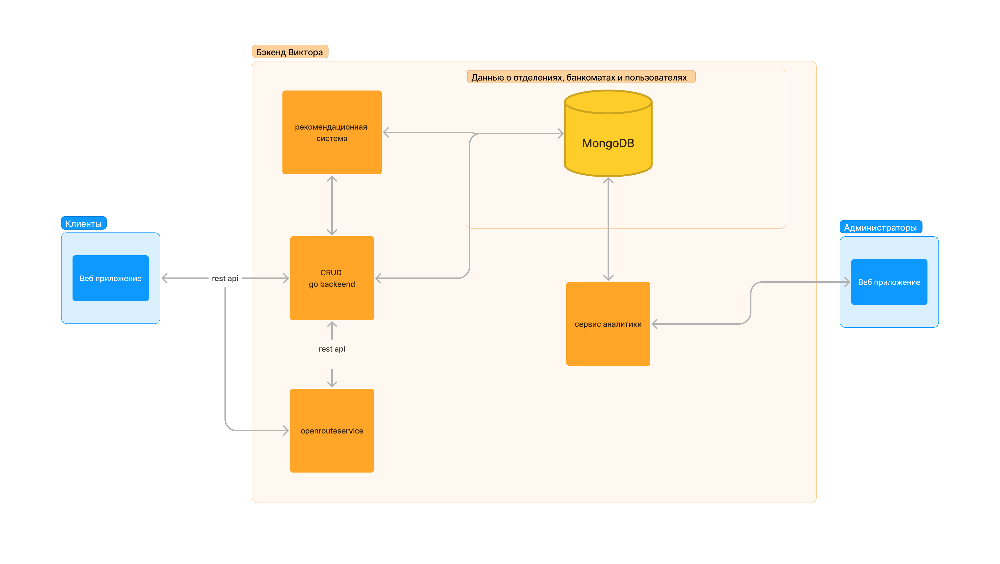

# [Ссылка на готовое решение](http://larek.itatmisis.ru)

# More-tech

Victor The Bear - решение трека "Сервис подбора оптимального отделения банка, учитывая потребности клиента и доступность услуг" на хакатоне More Tech 5.0

## Вау-фичи

#### Виртуальный ассистент Vitya The Bear, который поможет найти отделение банка, которое подойдет именно вам
- Очень многие пользователи отмечают, что для них трудно соспоставлять названия услуг в банке и то, что они хотят получить в действительности. 
- Витя решает эту проблему, определяя название за клиента

#### Возможность записи в отделение банка на определенное время
- Для удобства пользователей, которые не хотят тратить время на ожидание в очереди, мы предоставляем возможность записи в отделение на определенное время
- Сотрудники смогут контролировать все заявки через админ-панель и модерировать их в целях предотвращения простоя отделения

#### Прогнозируемое время выполнения услуги
- Возможность пользователю четко понимать, сколько займет путь до отделения, ожидание в очереди и выполнение услуги, решает проблему неопределенности и позволяет планировать свое время

## Описание

Данный репозиторий включает в себя несколько сервисов, которые в совокупности решают поставленную задачу. Все сервисы запускаются в контейнерах Docker. Для запуска сервисов необходимо установить [Docker](https://docs.docker.com/engine/install/) и [Docker Compose](https://docs.docker.com/compose/). Сервисы разделены на две части: frontend и backend. Backend разбит на 4 части:

-   [GO-API](https://github.com/EgorTarasov/more-tech/tree/main/go-backend) - сервис, который отвечает за обработку запросов от frontend и взаимодействие с базой данных. Реализован с использованием [GO](https://go.dev/) и фреймворка [Gin](https://github.com/gin-gonic/gin), в качестве базы данных используется [MongoDB](https://www.mongodb.com/) это позволило гарантировать высокую скорость обработки запросов и надежность. MongoDB была выбранна как документоориентированная бд, которя позволяет ускорить разработку, дает возможность быстро менять структуру данных и дает возможность маштабирования путем добавления новых серверов.
-   [Python-ml](https://github.com/EgorTarasov/more-tech/tree/main/python) - сервис, который отвечает за предсказание и рекомендацию отделения банка. Реализован с использованием [Python](https://www.python.org/) и фреймворка [FastApi](https://github.com/tiangolo/fastapi), в качестве библиотеки для машинного обучения используется [scikit-learn](https://scikit-learn.org/stable/). Для лемматизации используется pymorphy3. Это позвляет отвечать на запросы пользователей в режиме реального времени и дает возможность быстро менять модели машинного обучения.
-   [Python-backend](https://github.com/EgorTarasov/more-tech/tree/main/python-backend) Сервис отвечающий за продуктовую аналитику решения, включает в себя аналитику по продуктам, аналитику по отделениям. Реализован с использованием [Python](https://www.python.org/) и фреймворка [FastApi](https://github.com/tiangolo/fastapi), в качестве базы данных используется [MongoDB](https://www.mongodb.com/). Основная цель сервиса контроль качества работы решения, а также отображение статистики по отделениям .
-   [Frontend](https://github.com/EgorTarasov/more-tech/tree/main/frontend) Сервис отвечающий за пользовательский интерфейс приложения Реализован с использованием [React](https://reactjs.org/) и [Admiral-ui-kit](https://github.com/AdmiralDS) для соблюдения стилистики компании ВТБ. Основная цель сервиса предоставление пользователю удобного интерфейса для взаимодействия с решением.

## Документация сервисов

[GO-API](http://larek.itatmisis.ru:9999/swagger/index.html) - документация для go-API  
[Python-ml](http://larek.itatmisis.ru:8000/docs) - документация для python-ml  
[Python-backend](http://larek.itatmisis.ru:8001/docs) - документация для python-backend

## Функционал решения

-   Карта с отделениями и банкоматами ВТБ с отображение загруженности отделений (по цветам от синего до красного)
    
-   Рекомендация отделения на основе текстого запроса пользователя
-   Рекомендация отделения на основе фильтров (продуктов, услуг, геолокации)  
-   Возможность записи в отделение банка на определенное время (для удобства пользователя)  
-   Возможность оценки отделения банка (для улучшения качества решения)
-   Возможность мониторинга системы (для улучшения качества решения)


## Схема решения




## Запуск решения

Для упрощения работы с проектом используется Makefile с набором команд для запуска сервисов. Доступные команды:

-   swag - генерация документации для GO-API
-   debug - запуск сервисов в режиме отладки go и python
-   db_load - загрузка данных в базу данных
-   local - для тестирования решения локально для запуска требуется создать `.env` по примеру `.env.example`

```sh
# mongo требуется для соединения с БД
MONGO_INITDB_ROOT_USERNAME=mongouser
MONGO_INITDB_ROOT_PASSWORD=mongopass

# go-backend требуется для запуска go-API
SERVER_PORT=9999
SECRET_KEY=secret
MONGO_DB=dev


# deployment make deploy для деплоя решения на сервер с использоваением ssh и docker-compose
SERVER_URL=localhost
SERVER_USERNAME=ubuntu
SSH_KEY=ubuntu_rsa
GITHUB_USER=github_user


```

-   stop_local - остановка решения локально
-   deploy - для деплоя решения на сервер с использоваением ssh и docker-compose. Для использования необходимо указать следующие параметры в `.env`:

```sh
    SSH_KEY #- путь до ssh ключа
    SERVER_USERNAME #- имя пользователя на сервере
    SERVER_URL #- ip адрес сервера
```